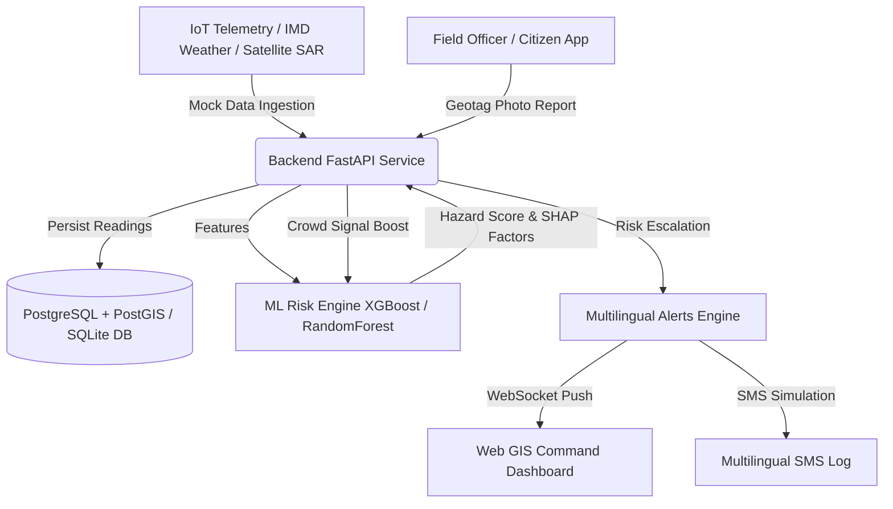

# NER-Sentinel: AI Early Warning & Landslide Monitoring Platform

**NER-Sentinel** is an end-to-end AI-powered Early Warning & Landslide Monitoring System tailored for high-risk mountain terrain across India's North Eastern Region (Assam, Meghalaya, Mizoram, Manipur).

---

## System Architecture



---

## Tech Stack

| Layer | Choice |
|---|---|
| **Frontend Web Dashboard** | React + Vite + TypeScript + TailwindCSS + Leaflet + Recharts |
| **Mobile Field App** | React Native (Expo) + TypeScript + Local Offline Queue |
| **Core Backend API** | Python 3.11 + FastAPI + SQLAlchemy + GeoAlchemy2 |
| **ML Hazard Engine** | Python + Scikit-Learn / XGBoost + FastAPI microservice |
| **Database** | PostgreSQL + PostGIS (with automatic SQLite fallback) |
| **Realtime / Telemetry** | WebSockets (`ws/live`) + APScheduler Data Ingestion |
| **Infrastructure** | Docker Compose monorepo |

---

## Quickstart & Local Setup

### Option A: Launching via Docker Compose (Recommended)
```bash
cd infra
docker compose up --build
```
- **Web GIS Dashboard**: `http://localhost:5173`
- **Backend API Docs**: `http://localhost:8000/docs`
- **ML Engine API Docs**: `http://localhost:8001/docs`

---

## Demo Simulation Command
To demonstrate a live rainfall spike causing a hazard escalation, automated alert generation, road blockage update, and real-time GIS dashboard push:

```bash
python backend/scripts/simulate_scenario.py
```

---

## Production Swap Roadmap (Integration-Ready Architecture)

Every mock service in NER-Sentinel is designed behind clean abstract interfaces (`ABC` / `Protocol`), ensuring a zero-friction drop-in swap for production deployment:

1. **IMD Weather Feed**: Replace `IMDWeatherProvider` in [`backend/ingestion/providers.py`](file:///c:/Users/admin/Desktop/rakshak/backend/ingestion/providers.py) with IMD's official REST API endpoint.
2. **Satellite SAR & InSAR Telemetry**: Swap `SatelliteImageryProvider` with ISRO Bhuvan / Sentinel-1 InSAR ground displacement APIs.
3. **SMS Gateway**: Replace `MockSMSProvider` in [`backend/alerts.py`](file:///c:/Users/admin/Desktop/rakshak/backend/alerts.py) with Twilio or CDAC Mobile Seva SMS gateway credentials.
4. **Historical Landslide Dataset**: Replace synthetic training in [`ml-engine/train.py`](file:///c:/Users/admin/Desktop/rakshak/ml-engine/train.py) with Geological Survey of India (GSI) / Bhukosh polygon inventory.
5. **Translation API**: Connect Google Cloud Translation API to dynamic alert generator in [`backend/alerts.py`](file:///c:/Users/admin/Desktop/rakshak/backend/alerts.py).

---

## Problem Statement Mapping
See [`PROBLEM_STATEMENT_MAPPING.md`](file:///c:/Users/admin/Desktop/rakshak/PROBLEM_STATEMENT_MAPPING.md) for a detailed 1-to-1 matrix mapping every problem statement requirement to code locations.
