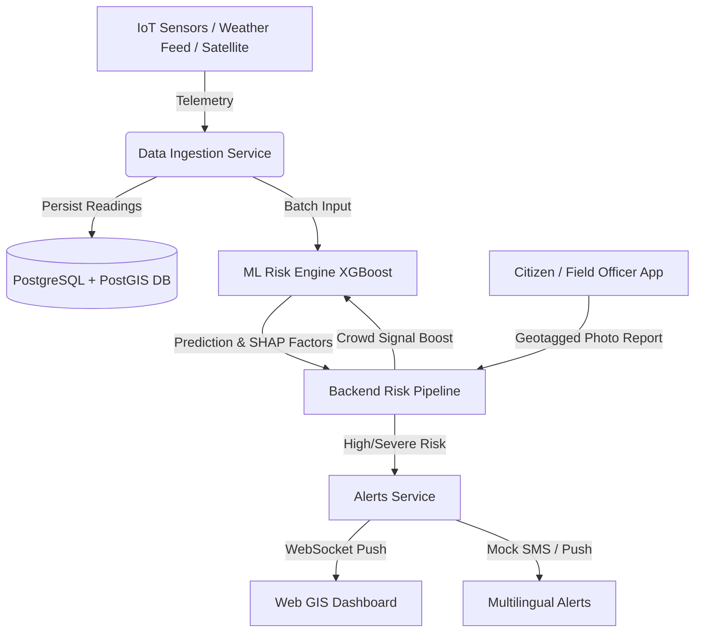

# NER-Sentinel Platform Architecture

## Overview
NER-Sentinel is an AI-powered Early Warning & Landslide Monitoring Platform designed for the North Eastern Region (NER) of India (Assam, Meghalaya, Mizoram, Manipur).

## System Components
1. **Backend Service (`/backend`)**: FastAPI, SQLAlchemy, GeoAlchemy2, WebSocket server, APScheduler for telemetry polling and alert processing.
2. **ML Risk Engine (`/ml-engine`)**: FastAPI service running an XGBoost classifier trained on geotechnical parameters (slope, 24h rainfall, 72h rainfall, soil moisture, historical landslide density).
3. **Web GIS Dashboard (`/web-dashboard`)**: React + TypeScript + Leaflet interactive command-center dashboard with risk polygon heatmaps, road overlays, Recharts analytics, and real-time alerts.
4. **Mobile Field App (`/mobile-app`)**: React Native / Expo application for geotagged report submissions and offline alert viewing.
5. **Infrastructure (`/infra`)**: Docker Compose environment wiring PostgreSQL/PostGIS, backend, ML engine, and web dashboard.
